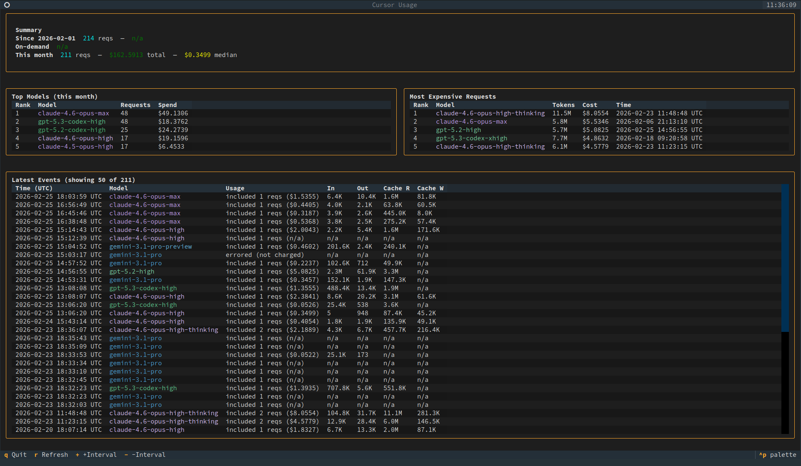

# Cursor Usage

Shows your Cursor on-demand usage and latest events by replaying the curl
command from the dashboard.



## Setup

```
python3 -m venv .venv
.venv/bin/pip install -r requirements.txt
```

## Getting the curl command

1. Open the [Cursor usage dashboard](https://cursor.com/dashboard?tab=usage) in a browser.
2. Open DevTools (F12) → Network tab.
3. Find the `get-filtered-usage-events` request, right-click → **Copy as cURL**.
4. Save it to a file (e.g. `curl.txt`).

## TUI Dashboard (recommended)

Launch the interactive dashboard:

```
.venv/bin/python cursor_usage_tui.py --curl-file ./curl.txt
```

### Keyboard shortcuts

| Key   | Action                              |
|-------|-------------------------------------|
| `r`   | Refresh data immediately            |
| `+`   | Increase auto-refresh interval +10s |
| `-`   | Decrease auto-refresh interval -10s |
| `q`   | Quit                                |

### TUI Options

- `--interval 60` (default) auto-refresh interval in seconds. Adjustable at runtime.
- `--limit 50` (default) number of latest events to show.
- `--minimal-headers` drop browser-only headers.
- `--keep-all-cookies` send all cookies from the curl command.
- `--cookie-allowlist WorkosCursorSessionToken,OtherCookie` override filtering.
- `--usage-user user_...` override billing usage lookup.

## CLI (plain text)

For a one-shot text summary:

```
.venv/bin/python cursor_usage.py --curl-file ./curl.txt
```

### CLI Options

- `--limit 20` (default) number of events shown.
- `--minimal-headers` drop browser-only headers.
- `--keep-all-cookies` send all cookies from the curl command.
- `--cookie-allowlist WorkosCursorSessionToken,OtherCookie` override filtering.
- `--no-color` disable ANSI colors.
- `--debug` print cookie/debug info to stderr.
- `--usage-user user_...` override billing usage lookup.
- `--dump-response events.json` save raw events JSON.
- `--dump-usage-response usage.json` save billing usage JSON.

## Notes

- By default, only `WorkosCursorSessionToken` is kept if present.
- The events request uses the current UTC month and auto-paginates with
  `pageSize=100` until all events are fetched.
- The billing-period total is fetched from `https://cursor.com/api/usage`.
